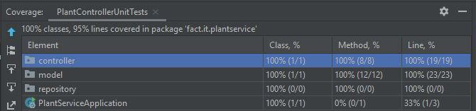

# Plant microservice

```
- /plants                                 GET
- /plants                                 POST
- /plants                                 PUT
- /plants/{plantNumber}                   DELETE
- /plants/{plantNumber}                   GET
- /plants/{gardencenterid}/plants         GET
- /plants/name/{name}                     GET
- /plants/description/{description}       GET
```

### Code coverage: 
[](https://coveralls.io/github/badges/shields?branch=main)
#####Unit tests:



#####Integration tests:

